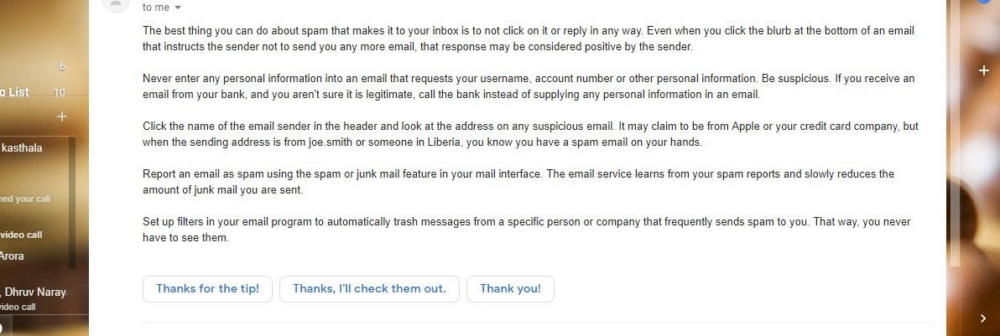
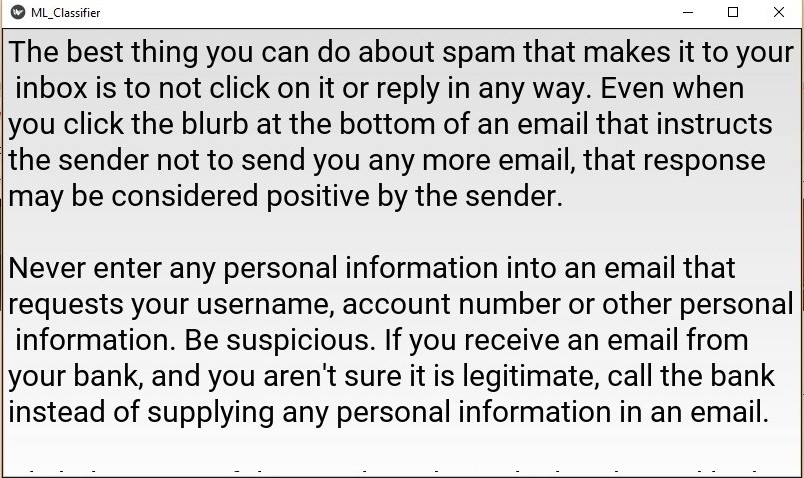
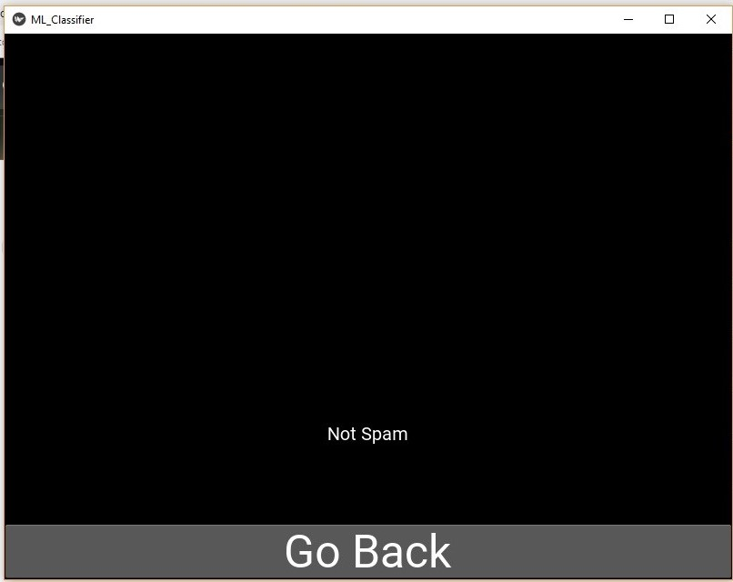
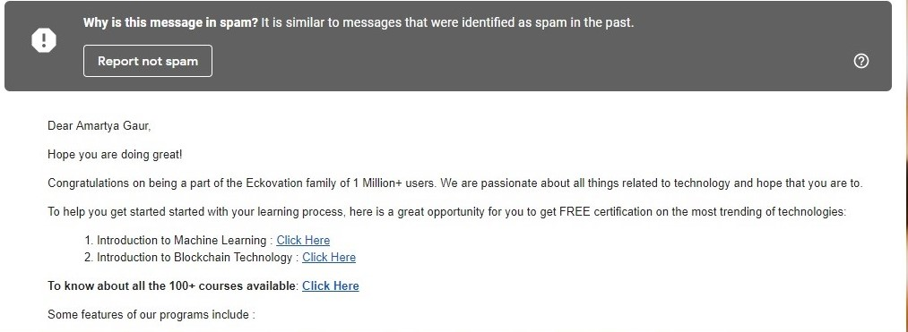
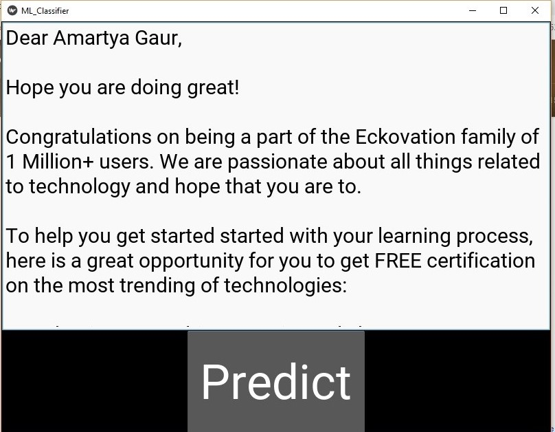
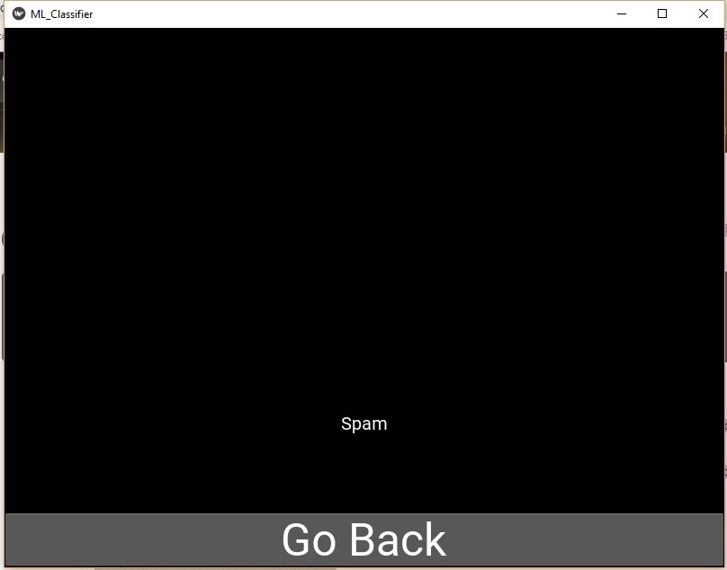

# Spam Filter

Through this project a spam filter is developed utilizing machine learning. 

There are at present remarkable approaches to manage spam emails. These strategies include boycotting, recognizing mass messages, analyzing message headings, greylisting, and content-based isolating. 

When we approach spam filtering from a machine learning perspective, we see the issue as an classifying issue. That is, we hope to bunch an email as spam or not spam (ham) dependent upon its component highlights. A case data point might be (x,y) where x is a d-dimensional vector depicting the component highlights and y has an estimation of 1 or 0, which implies spam or not spam. We will utilize the accompanying algorithms: 

a.	LinearSVC 

b.	NuSVC 

c.	AdaBoost classifier - for feature extraction

In addition, we will execute this spam filter as a GUI which will contain client input, a submit catch and a yield screen utilizing kivy module. 

# Steps to run 

1. Clone the repository
2. Install dependencies by pip install -r requirements.txt
3. Run main.py

# Output 

